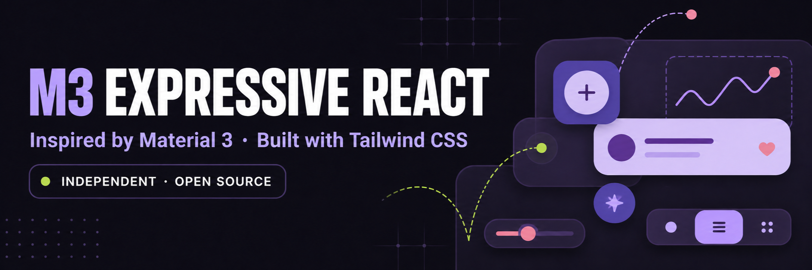

<p align="center">
  
</p>

<h1 align="center">M3 Expressive React</h1>

<p align="center">
  An independent React component library inspired by Google's Material Design 3 and Material 3 Expressive guidance. Built for the web with Tailwind CSS 4, Base UI, and Framer Motion.
</p>

<p align="center">
  Not affiliated with, sponsored by, or endorsed by Google.
</p>

<p align="center">
  <a href="https://github.com/jomarmontuya/m3-expressive/actions/workflows/ci.yml"></a>
  
  
  
  <a href="LICENSE"></a>
</p>

Install only what you need through the shadcn CLI. Each component becomes local source in your app, so you can inspect and adapt the implementation.

Current release target: `v0.1.0-beta.1`.

## Browse the registry

Open the [live visual catalog](https://m3-expressive.medianeth.dev/).

List all 42 registry items:

```bash
bunx shadcn@latest list jomarmontuya/m3-expressive
```

Inspect one component before installing it:

```bash
bunx shadcn@latest view jomarmontuya/m3-expressive/button
```

For a local catalog, run `bun run dev` and open `http://localhost:3000`. The raw registry is in [`registry.json`](registry.json).

## Install a component

Run this from a React project with Tailwind CSS 4 and a valid `components.json` file:

```bash
bunx shadcn@latest add jomarmontuya/m3-expressive/button#v0.1.0-beta.1
```

The component automatically installs `m3-base`. That shared item adds:

- Material color, shape, type, elevation, state, and motion tokens
- Roboto Flex and Material Symbols Rounded from Google Fonts
- `Ripple`, `MaterialSymbol`, `cn`, spring tokens, and text-direction support
- Base UI, Framer Motion, clsx, and tailwind-merge runtime dependencies

Import the installed file directly:

```tsx
import { Button } from "@/components/m3/Button";

export function SaveButton() {
  return <Button icon="save">Save changes</Button>;
}
```

Replace `button` in the install command with any component ID from the catalog. Same-repository dependencies are pinned to the same beta tag.

## What is included

- `registry.json` — the public registry with 41 components and `m3-base`
- `src/components/m3/` — installable component source
- `src/` — the Next.js catalog and live component demos
- `src/lib/m3/meta.ts` — component API and Material traceability metadata
- `docs/material-compliance.md` — spec sources, audit method, and declared deviations

`mcp-server/` is retained as unreleased source for possible later work. It is not part of this beta, not advertised, and not covered by the release checks.

## Local development

```bash
bun install --frozen-lockfile
bun run dev
```

Open `http://localhost:3000`.

Release checks:

```bash
bun run lint
bunx tsc --noEmit
bun run registry:check
bun run registry:validate
bun run registry:smoke
bun run build
```

The smoke check installs all 41 registry items into a temporary clean Next.js app, then typechecks and builds that app.

## Material sources and attribution

Google created [Material Design](https://m3.material.io/) and [Material 3 Expressive](https://m3.material.io/). This independent project uses Google's published guidance as its design reference.

Primary design sources:

- [Material Design 3 and Material 3 Expressive](https://m3.material.io/)
- [Google Design: the research behind Material 3 Expressive](https://design.google/library/expressive-material-design-google-research)
- [Material component guidance](https://m3.material.io/components)

Pinned implementation references used for web mapping:

- [AndroidX Compose Material3](https://android.googlesource.com/platform/frameworks/support/+/38aa2e813c80c10eb2326e211f9091ee7d79e069/compose/material3/material3/)
- [Material Web](https://github.com/material-components/material-web/tree/cac97678831d48d4eb4a606ca50f92673a1dc20c)
- [Flutter Material Banner](https://github.com/flutter/flutter/blob/d3b14c876900e553bc736ca19295fc09e3853e8e/packages/flutter/lib/src/material/banner.dart), used for the Banner compatibility extension
- [Base UI React Autocomplete](https://github.com/mui/base-ui/tree/254f4744f0a241c20697b9eeab33402f4469a081/packages/react/src/autocomplete), used for the Autocomplete extension

The React code in this repository is an independent implementation. It is not official Google code and is not affiliated with, sponsored by, or endorsed by Google. Material Design is a trademark of Google LLC.

Each component metadata record links to its source and lists its audit date, web mapping, and known deviations. See [docs/material-compliance.md](docs/material-compliance.md).

## License

MIT. See [LICENSE](LICENSE) and [THIRD_PARTY_LICENSES.md](THIRD_PARTY_LICENSES.md).
